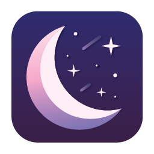

[](https://swift.org/)
[](https://support.apple.com/en-us/HT208969)
[](https://www.gnu.org/licenses/gpl-3.0)
<p align="center">
  <br>
  
  <h3 align="center">Nocturnal</h3>
  <p align="center">
    Have more control over your screen at night
  </p>
</p>

### About

Nocturnal is a menu bar app for macOS that allows you to go the extra mile in controlling your display settings to reduce strain on your eyes. It includes darker than dark dimming, Night Shift fine tuning, multi-monitor support, and the ability to turn off Touch Bar on Macbook Pro.

<p align="center">

</p>

### System Requirements

Nocturnal is only supported on macOS High Sierra 10.13 or later, and requires a Mac that supports [Night Shift](https://support.apple.com/en-us/HT207513#requirements).

### Installation

Download the latest version of Nocturnal from the [GitHub releases page](https://github.com/joshjon/nocturnal/releases).

**Releases are not currently signed with an Apple developer account. To open an unsigned app follow these steps.**

1. Control-click the app icon, then choose Open from the shortcut menu.
2. A dialog box will appear, then click Open.

For more information refer to the offical [Apple support article](https://support.apple.com/en-au/guide/mac-help/mh40616/mac).

### Donate

Nocturnal will always be free and open source, however, please consider donating if you enjoy using the app.

<a href="https://www.paypal.me/joshuajon/">
  
</a>

### Build and Run

Build Nocturnal's dependencies using carthage and open the project in Xcode.

```bash
carthage bootstrap --platform Mac
open Nocturnal.xcodeproj
```