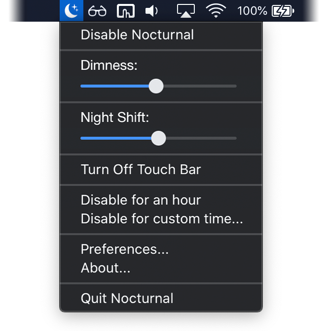

   
  
  <h3 align="center">Nocturnal</h3>
  

    Have more control over your screen at night
  

### About

Nocturnal is a menu bar app for macOS that allows you to go the extra mile in controlling your display settings to reduce strain on your eyes. It includes darker than dark dimming, Night Shift fine tuning, and the ability to disable for custom time periods.

### System requirements
- macOS Sierra 10.12.4 or later
- One of the Mac computers listed [here](https://support.apple.com/en-us/HT207513#requirements)

---

### Author

Joshua Jon 
GitHub: https://github.com/joshjon
